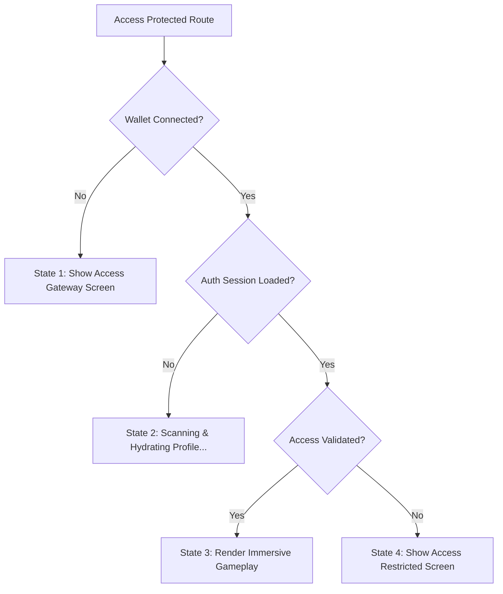

# ACCESS CONTROL AUDIT REPORT // RED QUEEN TERMINAL
**Classification:** LEVEL 5 RESTRICTED
**Status:** FULLY ENFORCED // SECURED

---

## 1. Protected Access Surfaces

### Protected Client Routes (UI)
* **`/operations`**: The central campaign map, sector status hubs, active missions, and deployment dashboards.
* **`/operative`** (redirect target of `/profile`): Operative passport details, AI name generators, and biometric statistics.
* **`/admin`**: The master override panel (invite generation, balance queries, player directory, and metrics).

### Protected Server Routes (APIs)
* **`/api/profile` (GET & POST)**: Client request handlers that query or write player state. Secured to prevent access or modifications to records that are not owned by the active session.

---

## 2. Implemented Route Guard Middleware

The gateway logic is centralized in the React component **`components/AccessGuard.tsx`**. It wraps each protected page export and dynamically controls rendering based on the **4 Authorization States**:

### State 1 (Wallet Disconnected)
* Blocks access completely. Displays a cyber alert warning stating "BETA DEPLOYMENT DETECTED".
* Renders a wallet connection widget (`WalletMultiButton`).
* Lists target Closed Beta criteria.

### State 2 (Decrypting Portal)
* While connecting sessions or executing profile queries, shows a cyber progress indicator: `[ SECURING ENCRYPTED ACCESS PORTALS... ]`.

### State 3 (Access Granted)
* Passes verification checks and mounts the target page.

### State 4 (Access Restricted)
* Warns that holdings or invite requirements are unmet.
* Displays verified metrics ($THREAT balance, Holder Tier).
* Integrates a key input to activate invites in real-time.
* Provides a manual "RE-VERIFY HOLDINGS" hook to audit on-chain balances.

---

## 3. Security Validation & Session Rules

1. **Authentication Rule**:
   A user is authenticated if they possess a valid connected wallet and an associated Supabase session token.
2. **Access Gating Rule**:
   Clearance is granted if and only if:
   * The database record confirms `verified_balance >= 1,000,000 $THREAT` (or `holder_tier >= 2`).
   * **OR** the database record confirms `access_type = 'Invite'` or `access_type = 'Holder'`.
3. **API Level Enforcement**:
   Both `GET` and `POST` handlers in `/api/profile` retrieve the user identity directly from Supabase Authentication (`supabase.auth.getUser()`). Mismatches between the session owner and the parameter payload reject with `401 Unauthorized` or `403 Forbidden`.

---

## 4. Remaining Known Issues
* **Mainnet RPC Speed limits**: Balance verification queries Solana Mainnet RPC nodes on-chain. Under heavy load, free RPC public nodes may respond slower, delaying profile state updates. Adding dedicated RPC endpoints to `SOLANA_RPC_URL` in production avoids this.
