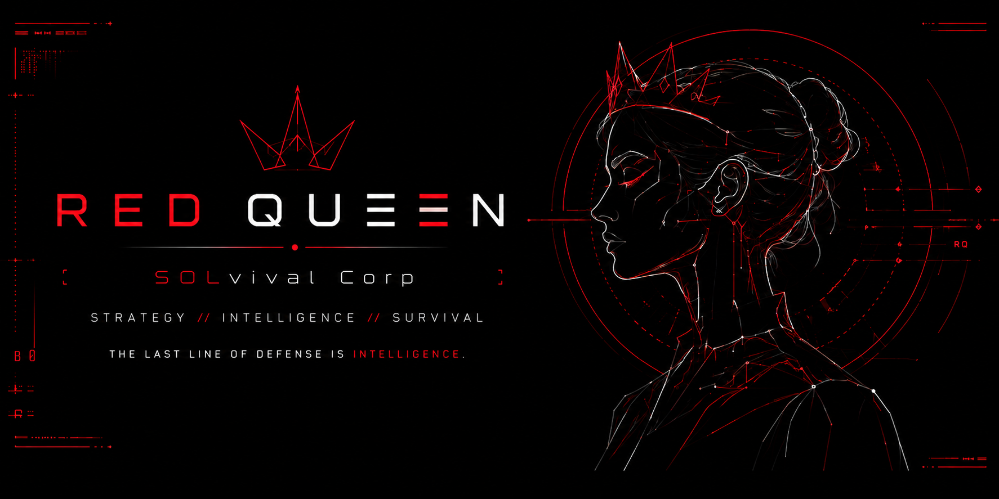
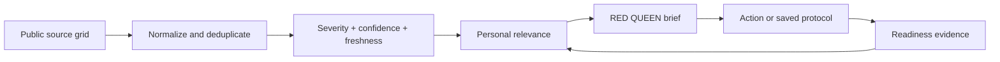

# RED QUEEN

**A survival intelligence ecosystem on Solana.**

RED QUEEN turns verified threat signals into clear assessments, practical preparedness actions, and evidence-based readiness training. The core product is not a panic feed and not a game: it is a daily system for understanding risk and becoming harder to surprise.

Production: [redqueen.space](https://redqueen.space) · X: [@redqueen_agent](https://x.com/redqueen_agent)



> Pulse is her eyes. The map is her nervous system. The library is her memory. Prepare is her hands. Community is her voice. RED QUEEN is the brain connecting them.

## Why return tomorrow?

RED QUEEN is designed around one short daily question: **what changed, does it affect me, and what should I do next?** A useful session should take less than a minute to produce a broad-area status, a small set of ranked signals, one source-grounded Queen brief, and one action worth completing.

## Core product loop

1. **Detect** — read a broad-area Local Pulse and explore verified signals on the live map.
2. **Understand** — ask RED QUEEN what a signal means for a broad region, household, device, or wallet.
3. **Prepare** — save one Queen action into My Action Plan, complete it locally, or adapt it into a checklist or 72-hour protocol.
4. **Prove and improve** — ask Queen to review what was actually done. Only eligible evaluated evidence can update BIO-SCORE; a local completion mark never does.

| Route | Product role |
| --- | --- |
| `/` | Daily Pulse, First Contact, verified Live Map |
| `/terminal` | Context-aware RED QUEEN agent: Monitor, Analyze, Prepare, Simulate |
| `/survival-kit` | Local preparedness checklist and protocols |
| `/threat-vector` | Real-world, digital, fictional, and satirical scenario library |
| `/community` | Queen transmissions, practical field notes, labeled lore, and SOLvivor contribution paths |
| `/operative` | My Readiness: identity, BIO, XP, evidence, memory, token clearance |
| `/network-clearance` | Solana control plane and live `$THREAT` utility proof |

The unfinished Operations game is intentionally disabled and excluded from the current product navigation.

Local Pulse resolves only a user-entered city or region, never an exact address. Broad-area geocoding is user-triggered, cached, provider-swappable, and currently uses OpenStreetMap Nominatim with attribution. The public endpoint is suitable only for moderate use under its usage policy; production scale should use a dedicated or commercial provider.

## Current product status

| Capability | Status | Honest boundary |
| --- | --- | --- |
| Daily Pulse and ranked signal grid | **Live** | Falls back to an explicit sensors-limited state when upstream sources are unreachable. |
| Interactive Map and incident dossiers | **Live** | Geospatial coverage depends on source coordinates; no marker is presented as proof of personal danger. |
| Signal Watch and browser alerts | **Live / foreground** | Watch state stays on-device. Opt-in notifications fire only for new matches while RED QUEEN is open; background push and account sync are not claimed yet. |
| RED QUEEN Monitor / Analyze / Prepare / Simulate | **Live** | Live claims require selected source context; general knowledge and simulation are labeled separately. |
| Preparedness checklist and saved Queen protocols | **Live** | Private plans currently persist in the browser; they are not published on-chain. |
| BIO-SCORE and SOLvivor profile | **Live** | BIO changes only through eligible evaluated evidence, never from holdings or ordinary chat volume. |
| `$THREAT` clearance and Queen Visage | **Live / configured environments** | Balance proof is read from Solana; image generation also requires an OpenAI key and a holder proof refreshed within 30 minutes. |
| x402 exact-USDC intelligence endpoints | **Runtime-gated beta** | Disabled unless recipient, facilitator, network, migration, and receipt store pass health checks. |
| Agent Registry, attestations, Kora, Blinks, Seeker polish | **Planned** | These follow a stable web core and are not described as shipped features. |

## Verified signal grid

The core signal engine normalizes seven public source families into one contract with source, timestamp, severity, confidence, freshness, assessment, and recommended action:

- **USGS** — recent significant earthquake observations;
- **NASA EONET** — open natural events with usable geospatial context;
- **GDACS** — official global disaster alerts;
- **NOAA SWPC** — space-weather notices affecting communications, navigation, or power monitoring;
- **CISA KEV** — vulnerabilities with known exploitation evidence;
- **WHO DON** — acute public-health event notices;
- **Official Solana Status** — unresolved Mainnet/RPC incidents and component degradation. An operational network correctly produces `NO_SIGNALS`, not a fabricated alert.

Source health is visible as `ONLINE`, `NO_SIGNALS`, or `OFFLINE`. “No matching signal” and “the source could not be reached” are intentionally different states.



## Intelligence trust contract

RED QUEEN responses separate:

- verified facts;
- Queen assessment;
- uncertainty and missing evidence;
- one practical next action.

Fictional and satirical scenarios remain in the library and are never presented as live alerts. Wallet diagnostics never claim access to private identity data, IP logs, geolocation, Chainalysis, TRM, Elliptic, or other compliance vendors unless a real integration and source are present.

## Solana control plane

The project uses Solana for three separate jobs. They must not be conflated.

### 1. Wallet identity — SIWS

Supabase Web3 Auth verifies a domain-bound, timestamped Sign In With Solana message through the connected wallet adapter. Signing in is off-chain and sends no transaction.

### 2. `$THREAT` holder proof

The server reads the canonical SPL mint on Solana mainnet, aggregates matching token accounts, and maps the live balance to RED QUEEN clearance. RPC failures fail closed: cached balances are not accepted as fresh proof.

Canonical mint: `3SBP25W239gQwTjTebshDcyNKBzM1J9ADRyqDqLQpump`

| Level | Balance | Context | Signal watches | Signals / synthesis | Analysis | Earned XP |
| --- | ---: | ---: | ---: | ---: | --- | ---: |
| Civilian | Public | 6 messages | 2 | 2 | Essential | ×1.00 |
| Scout | 1+ | 10 messages | 3 | 3 | Standard | ×1.05 |
| Analyst | 100K+ | 14 messages | 4 | 4 | Detailed | ×1.10 |
| Sentinel | 500K+ | 18 messages | 5 | 5 | Advanced | ×1.15 |
| Command | 1M+ | 24 messages | 6 | 6 | Strategic | ×1.20 |

Token holdings expand intelligence capacity and engagement XP. Signal Watch passes source IDs rather than copied claims; the server resolves each signal again and includes only confidence-verified records up to the active comparison limit. Holdings never create BIO-SCORE or prove survival competence.

Verified holders can also use **Queen Visage** in My Readiness: upload a portrait and generate a local RED QUEEN-style SOLvivor identity image. The source portrait is sent to the configured image provider only after explicit generation, and RED QUEEN stores the generated result only in that browser unless the user downloads or shares it.

### 3. AI compute payments — x402

Premium HTTP resources can request an exact USDC payment through the x402 SVM scheme. The network, asset, amount, and receiving wallet must be displayed before approval. Wallet connection and SIWS authentication never authorize payment.

Current implementation uses x402 v2 packages with Solana CAIP-2 network identifiers. Each paid request carries an operation UUID; successful settlement proof and delivered output are stored server-side, and an exact replay of the same signed request returns the original delivery without another payment. Production settlement stays disabled unless the facilitator, explicit `SVM_ADDRESS`, and the `x402_operations` receipt store are all healthy.

The 0.01 USDC global synthesis now uses the same seven-source normalized signal engine as Pulse. It requires at least four reachable source families before delivery; a `503` handler response cancels settlement and never substitutes fictional or cached “safe default” telemetry. Payment requirements, including the current recipient and asset, come from the runtime HTTP 402 challenge rather than static documentation.

Apply `supabase/migrations/20260817170000_create_x402_operations.sql` to the linked Supabase project before enabling x402. The table has RLS enabled and intentionally exposes no browser policies; only the server service role can read payment receipts or paid outputs.

Official references: [Solana Actions and Blinks](https://solana.com/developers/guides/advanced/actions), [Solana Mobile Wallet Adapter](https://docs.solanamobile.com/get-started/web/apps), [x402 specification](https://github.com/x402-foundation/x402/blob/main/specs/x402-specification-v2.md), [Supabase Web3 Auth](https://supabase.com/docs/guides/auth/auth-web3).

## Next Solana integrations

- Solana Actions/Blinks for shareable RED QUEEN protocols and paid intelligence actions, after the core daily loop is stable.
- Mobile Wallet Adapter and the Seeker Android build are intentionally deferred until the web product is production-ready.
- Holder-specific alert channels and compute allowances.
- Privacy-preserving credentials only if readiness data can remain private by design.

Token-2022 is not treated as a cosmetic upgrade. Extensions are selected when a mint is created and cannot simply be added to the existing `$THREAT` mint.

## Local development

Requirements: Node.js 22+, npm, a Supabase project for persistent accounts, and an OpenAI API key for the agent.

```bash
npm install
cp .env.local.example .env.local
npm run dev
```

Open `http://localhost:3000`.

Important environment groups are documented in `.env.local.example`:

- OpenAI agent configuration;
- Supabase browser and server credentials;
- Solana RPC endpoints;
- x402 SVM settlement configuration;
- optional protected treasury automation.

Never expose the Supabase service role, treasury private key, facilitator secret, or wallet salt through a `NEXT_PUBLIC_` variable.

## Technical stack

- Next.js 16 App Router and React 19
- TypeScript
- OpenAI Responses API with structured outputs
- Supabase Auth and Postgres
- Solana Wallet Adapter, `@solana/web3.js`, `@solana/kit`
- SPL Token and x402 SVM
- MapLibre GL

## Repository boundaries

- `app/`, `components/`, and `lib/` contain the current web product and server routes.
- `supabase/migrations/` contains opt-in database changes required by newer server capabilities.
- `providers/redqueen/intel/` describes the machine-facing intelligence provider surface.
- `redqueen-mobile/` is retained but mobile/Seeker development is deferred while the web core is stabilized.
- Operations, factions, PvP, game marketplace, and combat systems are a separate future product track and are not part of the current core journey.

## Verification

Before promoting test changes to production:

```bash
npm run build
git diff --check
```

Then verify desktop and mobile flows for Pulse, Map, Queen, Prepare, Library, My Readiness, Login, and the On-chain Hub. All pushes are tested in `red-queen-test` before promotion to the public repository and `redqueen.space`.

## Safety

RED QUEEN provides informational threat analysis and preparedness guidance. It does not replace emergency services, official alerts, medical care, legal advice, or professional financial advice. Never enter a seed phrase, private key, exact home address, or sensitive recovery information into the platform.
