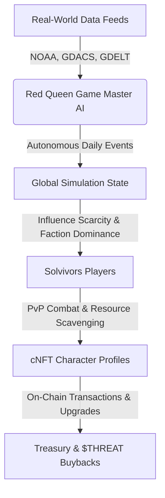

# RED QUEEN: THE SOLVIVORS GAME DESIGN DOCUMENT
*Version 1.2.0 — Classified Level 5 Intelligence*

---

## 1. Executive Summary & Core Vision
The **Red Queen Apocalypse Simulation** is a hybrid strategic survival RPG. It is operated on-chain on Solana and moderated by the autonomous **RED QUEEN AI**. 

The world itself is the main character: live real-world threat feeds (space weather, disease tracking, geological activity) directly influence game-world events, resource scarcity, and faction territories.

---

## 2. Design Aesthetics & Visual Style
The user interface feels like an active military tactical deck. It uses high-contrast sci-fi overlays, responsive grids, and CRT monitor simulation.

*   **Core Palette:** Ultra-low-mid tones, dark charcoal background (`#030303`), toxic warning red (`#ff003c`), accent neon blue (`#00aaff`), hazard orange (`#ff8800`), and stasis green (`#00ff88`).
*   **Typography:** Pure monospace readouts (using fonts like *JetBrains Mono* or *Orbitron*) for stats, status feeds, and command line tools, mixed with sharp geometric headers.
*   **Unified UI Accents (across all pages):**
    *   **CRT Scanlines**: `.hud-scanline` sweeps across the screen to simulate vintage monitor refreshes.
    *   **Frame Border**: A glowing screen border outline (`border: 1px solid rgba(255,0,60,0.07)`).
    *   **Grid Overlay**: Dotted background lattices (`40px 40px` dimensions) mimicking coordinate tracking meshes.

---

## 3. Screen Layouts & Room Backdrops (The 3 Core Spaces)

To avoid a repetitive layout, each core page represents a distinct room or terminal inside the bunker complex, utilizing unique background concept art:

### 3.1. PvP Duel Arena (`/arena`)
*   **Scenery Backdrop**: Dark combat coliseum void with red-crimson left ambient glow and blue-white right glow.
*   **Foreground Visuals**: Left silhouette (`redqueen_silhouette.png` with heavy red glow) face-to-face with the right opponent silhouette (`soldier_silhouette.png` with white glow).
*   **Center Panel**: Interactive 2D target-locking sweep reticle with coordinate nodes.
*   **Layout**: 3-column layout (Left: Operative status/Shield, Center: VS HUD/Log feed, Right: Opponent status/Attack lock selector) + bottom panels.

### 3.2. Command Bunker HQ (`/bunker`)
*   **Scenery Backdrop**: Command deck concept art (`bunker_backdrop.png` at `0.18` opacity) containing mainframe servers and glowing radar terminals.
*   **Foreground Visuals**: Completely clear of duel silhouettes to represent base HQ safety.
*   **Center Panel**: Tactical holographic sector radar. Blinking threat node markers (`TGT_ALPHA`, `SCAV_ZONE_4`, `SIGNAL_LOCK`) coordinates scan continuously.
*   **Layout**: 
    *   *Left Column*: Identity, circular animated Shield Ring, segmented resource meters (Water, Food, Power), and Daily Ops tracks.
    *   *Center Column*: Radar scanner + primary command console buttons (Arena Entry, Scavenge, Decrypt).
    *   *Right Column*: Compact 8-faction selector row, Bounty Targets ledger, and stasis clone chamber diagnostics.
    *   *Footer Deck*: Bunker chat feed, interactive command-line terminal shell, and live system log.

### 3.3. Player Operative Deck (`/player`)
*   **Scenery Backdrop**: Armory hangar inspection bay concept art (`player_backdrop.png` at `0.18` opacity).
*   **Foreground Visuals**: Single operative silhouette centered on top of a rotating holographic 3D circular pedestal.
*   **Tactical HUD Connectors**: Interactive SVG lines projecting from the inspect gear slots (Helmet, Vest, Gloves, Boots, Primary/Secondary/Sidearm) directly to the corresponding body nodes of the silhouette. Dotted connections light up bright neon red when hovered or selected.
*   **Layout**: 3-column deck (Left: Identity card + detailed stat bars, Center: Loadout grid & Stats/Achievements tabs, Right: Item Inspector detailing power, attributes, and custom talents).

---

## 4. Implemented Mechanics (How Everything Works)

### 4.1. Turn-Based Tactical PvP Combat
*   **Limb-Targeting Resolution**: Both players select an attack vector (HEAD, TORSO, ARMS, LEGS) and a defensive shield sector concurrently.
    *   **HEAD**: 35% accuracy, 50 base damage. Inflicts `GLITCHED` status.
    *   **TORSO**: 85% accuracy, 24 base damage. Inflicts `BLEEDING` status.
    *   **ARMS**: 55% accuracy, 28 base damage. Disables opponent block.
    *   **LEGS**: 100% accuracy, 14 base damage. Inflicts `SLOWED` status.
*   **Environmental Modifiers**: Environmental factors (Toxic Fog DoT, Scarce Ammo, Electro-Surge speed adjustments) dynamically calculate round logs.
*   **Escrow Stakes**: Each match locks in a `$THREAT` token wager, automatically claimed by the winner.

### 4.2. Bunker Shield & Escrow Staking
*   Staking `$THREAT` inside the bunker menu updates the shield integrity percentage in real-time.
*   The shield formula incorporates active faction modifiers:
    $$\text{Shield Integrity} = \min(99\%, \text{Base} \times \text{Faction Bonus} + 8.5 \times \log_2(\text{Staked } \$THREAT + 1))$$
*   Staking protects resources from offline raids.

### 4.3. Resource Decay Simulation
*   Life support systems (Water, Food, Power grids) drift dynamically every few seconds.
*   If levels fall below critical thresholds (30%), resource meters turn warning red, impacting operative recovery statistics.

### 4.5. Interactive CLI Decryption
*   The foot console allows players to type native shell commands (`help`, `clear`, `status`, `scan`, `decrypt`).
*   Running `decrypt` initiates an asynchronous bypass protocol parsing sector codes to unlock classified coordinates.

### 4.6. Character Loadout & Stat Inspector
*   Operatives equip items of varying tiers (**Common**, **Uncommon**, **Rare**, **Epic**, **Named**) each displaying tier-colored glows.
*   Inspection highlights item attributes, power score, and custom active talents.
*   Total gear score dynamically recalculates.
